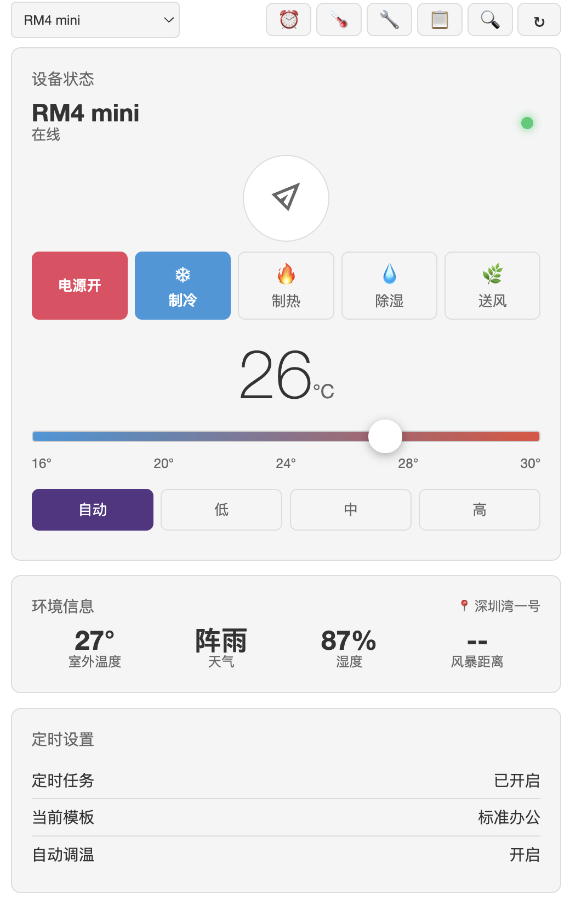
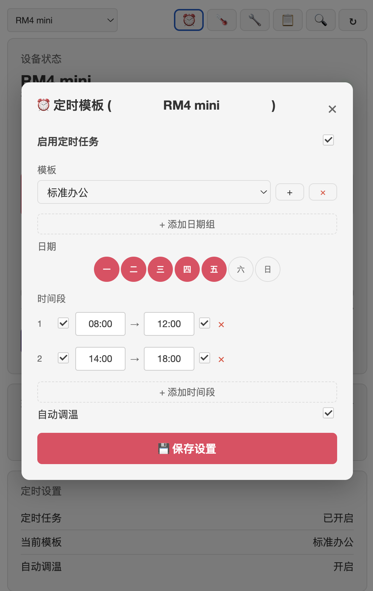
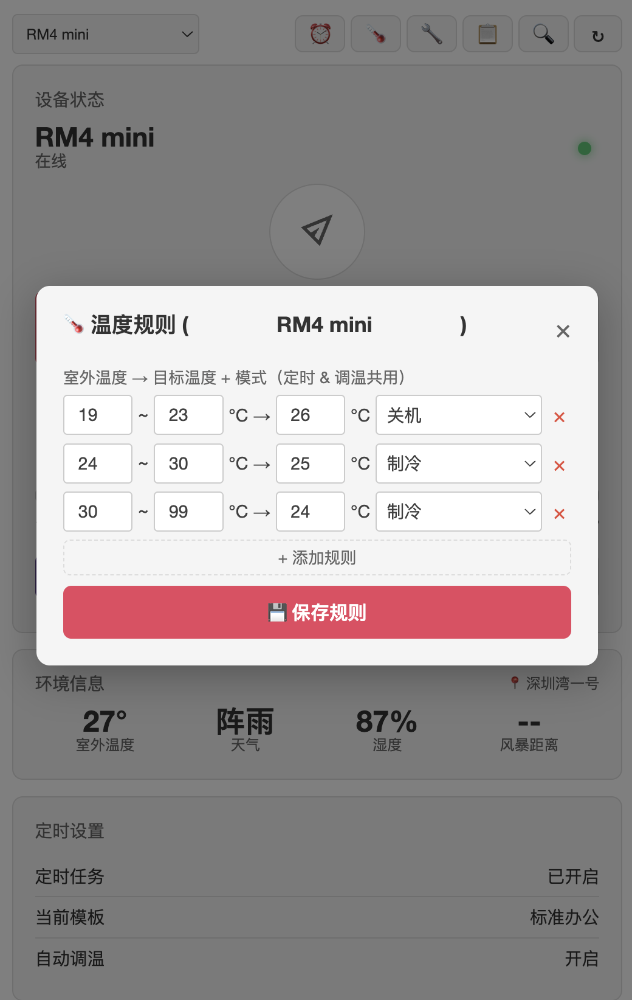
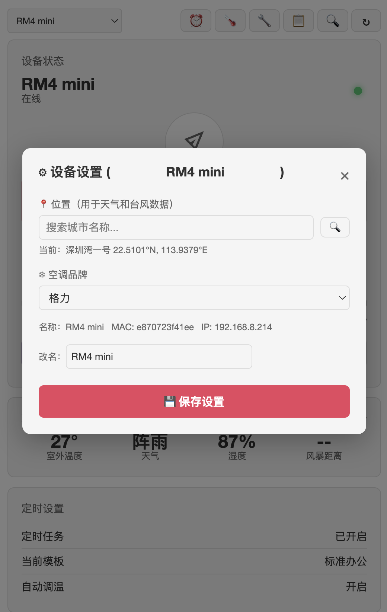

[中文](README.md) / [English](README_EN.md)

# BroadlinkAC-OpenWRT

> OpenWRT 路由器端 Broadlink 全自动空调控制插件。自动获取天气数据，7×24小时无人值守管控空调。

[](LICENSE)
[]()
[]()

## ✨ 特性

- 🎛️ **LuCI 控制面板** — Web 界面遥控空调、定时模板、温度规则、设备管理
- 🌤️ **天气双数据源** — 百度 + 和风，自动回退 + 旧值兜底
- 🌀 **风暴自动保护** — 台风距离 < 100km 强制关闭所有空调
- ⏰ **多日期组定时模板** — 工作日一套、周末一套，支持多时间段
- 🌡️ **独立温度规则** — 定时和调温共用，自动根据室外温度决策
- 🏷️ **多设备管理** — 支持多台博联，自动去重，自定义昵称
- 🛡️ **内置 hvac_ir** — 13 种红外协议直接打包，零 pip 依赖
- 📥 **日志下载** — 14 天日期网格 + Markdown 文件下载

## 📸 截图

| 主界面 | 定时模板 |
|--------|----------|
|  |  |

| 温度规则 | 设备设置 |
|----------|----------|
|  |  |

## 🚀 快速开始

### 方式一：IPK 安装（推荐）

从 [Releases](https://github.com/oywq00008-cell/BroadlinkAC-OpenWRT/releases) 下载 `broadlinkac_3.2-1_all.ipk`。

打开路由器 LuCI 网页 → 系统 → 软件包 → 上传软件包，选择 IPK 文件即可自动安装。

### 方式二：.run 一键安装

从 [Releases](https://github.com/oywq00008-cell/BroadlinkAC-OpenWRT/releases) 下载 `BroadlinkAC-3.2.zip`，解压后：

```bash
# 上传到路由器
scp broadlinkac_3.2.run root@你的路由器IP:/tmp/

# 执行安装
ssh root@你的路由器IP "bash /tmp/broadlinkac_3.2.run"
```

> 详细步骤见压缩包内的 `使用说明.txt`（含 macOS / Windows / Linux 三平台教程）

### 开始使用

浏览器打开 `http://你的路由器IP/cgi-bin/luci/admin/services/broadlinkac`

**首次使用需要：**
1. 去「设置」页填写和风天气 API Key（[免费申请教程](https://github.com/oywq00008-cell/BroadlinkAC-OpenWRT/blob/main/docs/使用指南.md#申请天气-api免费)）
2. 搜索选择你的城市位置
3. 点击「扫描设备」发现博联 RM
4. 在设备设置中选择你的空调品牌

## 🎛️ 支持的空调品牌

格力、美的、华凌、小米、海尔、海信、日立、大金、三菱、松下、富士通、奥克斯、巴鲁、开利、现代、Fuego

## 📂 项目结构

```
├── broadlinkac/files/          # 插件源代码
│   ├── usr/lib/broadlinkac/    # Python 后端
│   │   ├── hvac_ir/            # 红外协议（内置）
│   │   ├── protocols/          # 自定义协议
│   │   └── broadlinkac_core/   # 核心逻辑
│   └── usr/lib/lua/luci/       # LuCI 界面
├── build_ipk.py                # IPK 构建脚本
├── build_run.sh                # .run 构建脚本
├── install_manual.sh           # 手动安装脚本
└── docs/                       # 文档
```

## 🔗 姊妹项目

**[BroadlinkAC-For-Agent](https://github.com/oywq00008-cell/BroadlinkAC-For-Agent)** — 跨平台桌面 GUI + AI Agent 接口（Windows / macOS / Linux）。

两个项目共享核心算法，独立进化：
- 桌面端：用户主动操作 + 丰富交互
- 路由器端：7×24 无人值守 + 自动响应

## 📝 License

MIT — 详见 [LICENSE](LICENSE)

## 🙏 致谢

- 红外协议基于 [python-broadlink](https://github.com/mjg59/python-broadlink) 和 [hvac_ir](https://github.com/shprota/hvac_ir)
- 天气数据来自百度地图开放平台 + 和风天气
- 风暴数据来自中国中央气象台 (NMC) + 美国国家飓风中心 (NHC)
