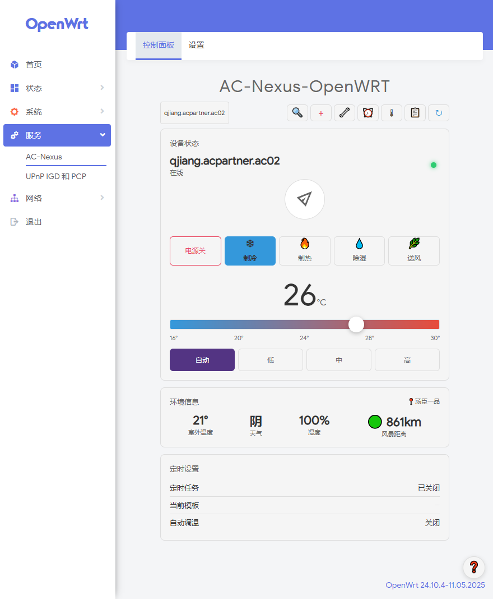
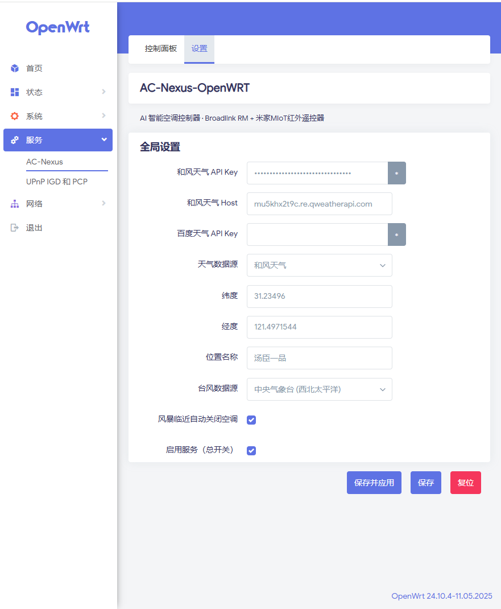
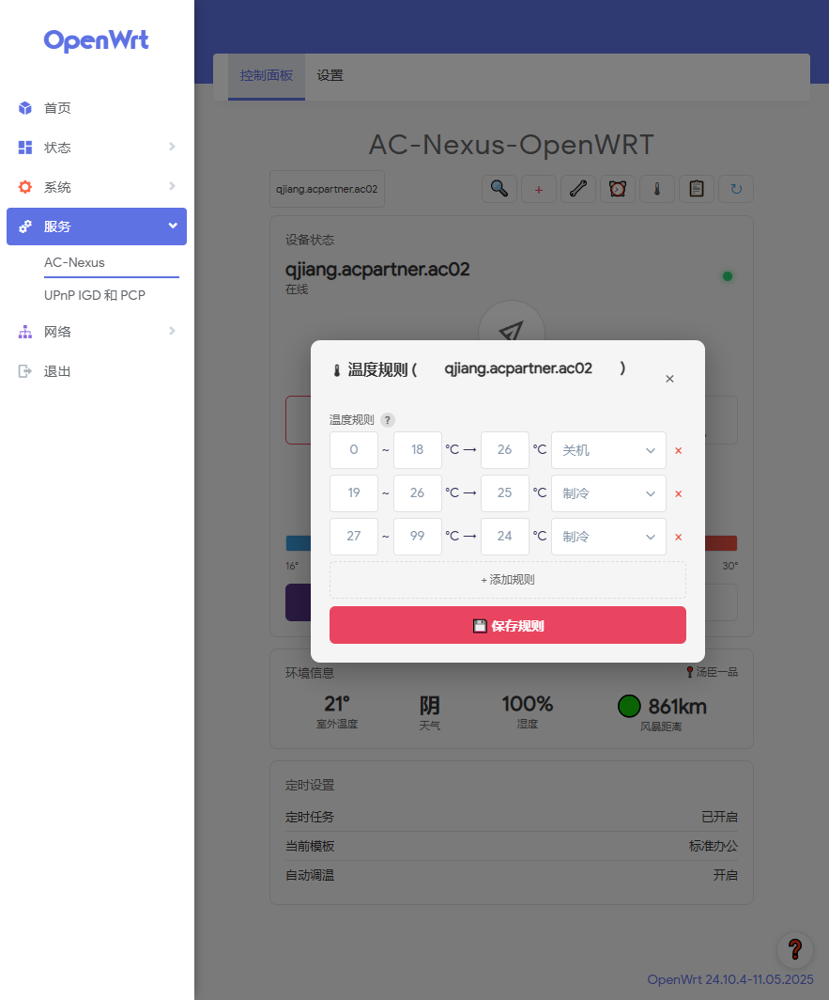

[中文](README.md) / [English](README_EN.md)

# AC-Nexus-OpenWRT

> AC-Nexus rewritten specifically for OpenWRT routers — all major features preserved with extreme lightweight design, re-engineered for low-performance routers. Fully automatic AC control plugin. Supports Broadlink RM IR remotes and all Xiaomi Mijia MIoT ecosystem smart IR remotes. Auto weather fetching, intelligent storm wind-speed + distance shutdown, 24/7 unattended operation, automatic on/off and temperature adjustment based on outdoor conditions.

[](LICENSE)
[]()
[]()

## ✨ Features

- 🎛️ **LuCI Control Panel** — Web UI for AC remote control, schedule templates, temp rules, multi-device management
- 🌤️ **Dual Weather Source** — Baidu + QWeather, auto-fallback + stale-cache rescue
- 🌀 **Storm Auto-Protection** — 3-tier wind-speed/distance threshold: super typhoon 100km / typhoon 70km / default 50km, auto-shutdown + schedule pause
- ⏰ **Multi-Group Schedule Templates** — Separate weekday/weekend schedules with multiple time slots
- 🌡️ **Temperature Rules** — Auto-select target temp/mode based on outdoor temperature
- 🏷️ **Multi-Device Management** — Broadlink RM / Xiaomi AC Partner / Xiaomi Mijia IR Remote, auto-dedup, custom nicknames
- 🔌 **Xiaomi MIoT Full Support** — OAuth QR login, auto device list, per-model siid/piid online matching, 3400+ model local index
- 🛡️ **Built-in Core Libs** — hvac_ir, broadlink, schedule, pyaes all bundled, zero pip dependencies
- 📥 **Log Download** — Per-day Markdown archives, one-click download from browser

## 📸 Screenshots

| Dashboard | Schedule & Auto-Adjust |
|-----------|------------------------|
|  |  |

| CBI Settings | Temperature Rules |
|--------------|-------------------|
|  |  |

## 🚀 Quick Start

> **Prerequisite: Router has internet, ≥ 15MB free storage.**

### Option A: IPK via LuCI (Recommended ⭐)

Easiest for beginners. Download `acnexus_*.ipk` from [Releases](https://github.com/oywq00008-cell/AC-Nexus-OpenWRT/releases):

1. Open router LuCI web interface
2. **System → Software → Upload Package**
3. Select the downloaded `.ipk` file
4. Wait for install, refresh the page — done.

> The IPK installer auto-handles: CRLF fix, permissions, Python module check, config.json generation, LuCI cache refresh, and service start. **Zero manual steps required.**

### Upgrading from Old BroadlinkAC

Before installing the new version, run the cleanup script on your router:

```bash
scp cleanup_old_broadlinkac.sh root@your-router-ip:/tmp/
ssh root@your-router-ip "bash /tmp/cleanup_old_broadlinkac.sh"
```

Then install the new version via Option A or B above.

### First-Time Setup

Open `http://your-router-ip/cgi-bin/luci/admin/services/acnexus`

1. Fill in QWeather API Key in Settings page
2. Search and select your city location
3. Click **Scan** to discover Broadlink RM devices
4. Select your AC brand in device settings

## 🎛️ Supported Brands

Gree, Midea, Hualing, Xiaomi, Haier, Hisense, Hitachi, Daikin, Mitsubishi, Panasonic, Fujitsu, AUX, Ballu, Carrier, Hyundai, Fuego
> 💡 **xiaomi Mijia IR Remote Users**: IR remote controls that connect directly to Mi Home come with a massive official code library; simply link your air conditioner within the Mi Home app. Since the plugin operates via the MIoT protocol, it is not restricted by the brand list mentioned above.

## 🔗 Sister Project

**[AC-Nexus](https://github.com/oywq00008-cell/AC-Nexus)** — Cross-platform desktop GUI + AI Agent interface (Windows / macOS / Linux).

Both projects share core algorithms, evolving independently:
- Desktop: interactive UI + rich user controls
- Router: 24/7 unattended + automatic response

## ⚙️ Dependencies

The following system packages are auto-installed by opkg (no manual steps needed):

| Package | Purpose |
|---------|---------|
| `python3-light` | Python 3 runtime |
| `python3-urllib` | HTTP requests (weather/storm APIs) |
| `python3-email` | email module (urllib dependency) |
| `python3-openssl` | SSL/TLS for HTTPS |
| `python3-xml` | XML parsing (storm data) |

The following libraries are bundled inside the plugin — no extra installs required:

| Library | Purpose |
|---------|---------|
| `broadlink` | LAN discovery & communication with Broadlink devices |
| `hvac_ir` | Infrared code generation (13 brands) |
| `schedule` | Task scheduling engine |
| `pyaes` | Pure Python AES encryption |
| `_RC4` | Pure Python ARC4 (Xiaomi MIoT protocol) |

## 📝 License

MIT — see [LICENSE](LICENSE)

## 🙏 Acknowledgments

- IR protocols: [python-broadlink](https://github.com/mjg59/python-broadlink) + [hvac_ir](https://github.com/shprota/hvac_ir)
- Weather data: Baidu Maps Open Platform + QWeather
- Storm data: China NMC + US NHC
